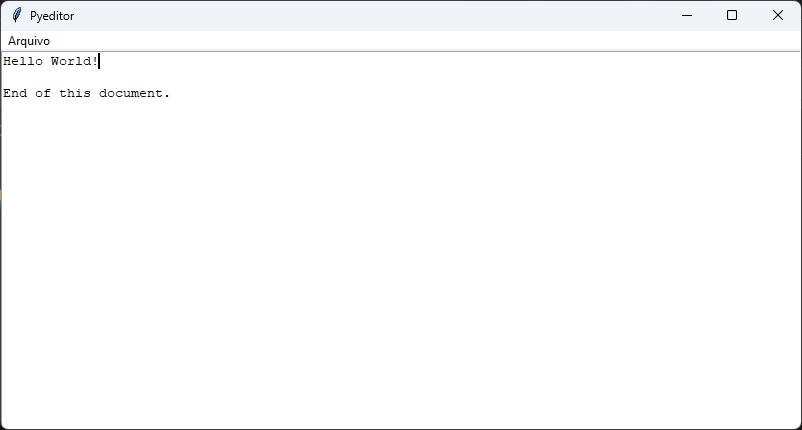

# Pyeditor

A simple text editor



## Development

This is a application written with Python 3.12 `tkinter` module. Run it by executing:

```bash
make start
```

In order to deploy this software into a executable, first install `pyinstaller` module

```bash
pip install -U pyinstaller
```

Then, create its executable

```bash
make deploy
```